# Course

This is project Spring Boot Web name "Spring E-Commerce GEAR SHOP" build with Spring Boot Framework.

Demo Website: https://youtu.be/SePACispRVA

## Feature

* CRUD
* Validation
* Security
* Responsive
* Admin module + User module

## Requirements

* Java SDK 17
* Apache Tomcat >= 9.0
* MySQL >= 8.0
* Intellij IDEA >= 2022.3.0
* Spring Boot 2.7.9

## Technologies

* Java
* Spring Web
* Spring Security
* JPA - Hibernate
* Thymeleaf
* Maven / Gradle
* CSS
* Boostrap 5
* MySQL

## Installation

```
$ git clone https://github.com/diner262/Spring-E-Commerce-Midterm.git
$ cd Spring-E-Commerce-Midterm
```

Then create a database with name ecommerce_db in your MySQL. You can find database dump in sql/ecommerce_db.sql, import
it:

```
$ mysql -u <your user> -p <your password>
mysql> create database `ecommerce_db`;
mysql> use `ecommerce_db`;
mysql> source ecommerce_db.sql
```

### Build and Run

Then open the file "src/main/resources/application.properties" and enter the data according to the connection of your
database.

When the configuration is complete, just type in the terminal `mvn spring-boot: run` and open in your browser the
following address:

`http://localhost:8080/home`

#### Login Admin:

* Username: admin@gmail.com
* Password: abc123

#### Login Client:

* Username: din262bmt@gmail.com
* Password: 123


* Username: baokhoi262@gmail.com
* Password: abc123

### Project layout

```
|- sql/                                         // SQL migration scripts for MySQL database
|- src/main
|-  |- main/
|   |   |-java/tdtu.edu.vn.midterm
|   |   |   |- config/                          // Config Web Security
|   |   |   |- controller/                      // Folder containing REST Controllers
|   |   |   |- dto/                             // DTOs are declared here
|   |   |   |- model/                           // Folder containing Models
|   |   |   |- repository/                      // Folder containing Repos
|   |   |   |- security/                        // Service for Web Security                         
|   |   |   |- service/                         // Service business logic classes
|   |   |   |- MidtermApplication.java          // Application main() is here
|   |   |-resources
|   |   |   |- static/                          // Setup static file (CSS, JS,...)
|   |   |   |- templates/                       // Containing Front End for Website (HTML)
|   |   |   |- application.properties/          // File properties config project

|- src/test/                                    // Test folder
|- pom.xml                                      // Build dependencies for Maven
```

## Endpoints

### HTML

#### Client Module

| HTTP Method | URL                            | Description        | Note             |
|-------------|--------------------------------|--------------------|------------------|
| `GET`       | http://localhost:8080/home     | Home Page          ||
| `GET`       | http://localhost:8080/login    | Login Page         ||
| `GET`       | http://localhost:8080/register | Register Page      ||
| `GET`       | http://localhost:8080/cart     | Shopping Cart Page | Require to login |
| `GET`       | http://localhost:8080/profile  | Profile Page       | Require to login |

#### Admin Module

| HTTP Method | URL                                   | Description     |
|-------------|---------------------------------------|-----------------|
| `GET`       | http://localhost:8080/admin           | Dashboard       |
| `GET`       | http://localhost:8080/admin/products  | Manage Product  |
| `GET`       | http://localhost:8080/admin/orders    | Manage Order    |
| `GET`       | http://localhost:8080/admin/customers | Manage Customer |

### CRUD

#### Product Service

| HTTP Method | URL                                                     | Description          |
|-------------|---------------------------------------------------------|----------------------|
| `GET`       | http://localhost:8080/admin/products/add                | Add New Product Page |
| `POST`      | http://localhost:8080/admin/products/add                | Create New Product   |
| `GET`       | http://localhost:8080/admin/products/detail/{productId} | Product Detail Page  |
| `GET`       | http://localhost:8080/admin/products/edit/{productId}   | Edit Product Page    |
| `POST`      | http://localhost:8080/admin/products/edit/{productId}   | Edit Product By ID   |
| `GET`       | http://localhost:8080/products/delete/{productId}       | Delete Product By ID |

#### Order Service

| HTTP Method | URL                                                 | Description          |
|-------------|-----------------------------------------------------|----------------------|
| `GET`       | http://localhost:8080/admin/orders/update/{orderId} | Edit Order By ID     |
| `GET`       | http://localhost:8080/orders/delete/{orderId}       | Delete Product By ID |

#### Order Service

| HTTP Method | URL                                                       | Description           |
|-------------|-----------------------------------------------------------|-----------------------|
| `GET`       | http://localhost:8080/admin/customers/update/{customerId} | Edit Customer By ID   |
| `GET`       | http://localhost:8080/customers/delete/{customerId}       | Delete Customer By ID |

## Model ER

### Logical Model

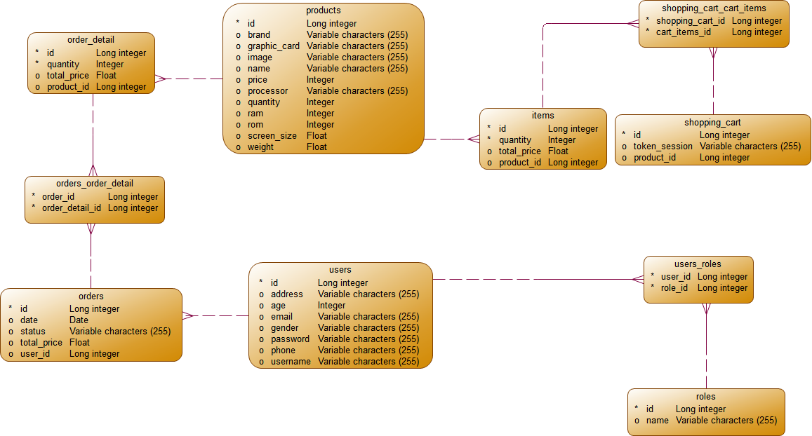<br><br>

### Physical Model

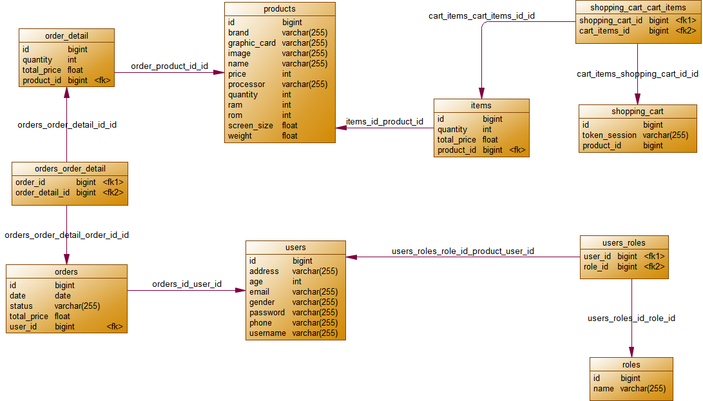<br><br>

## Screenshots

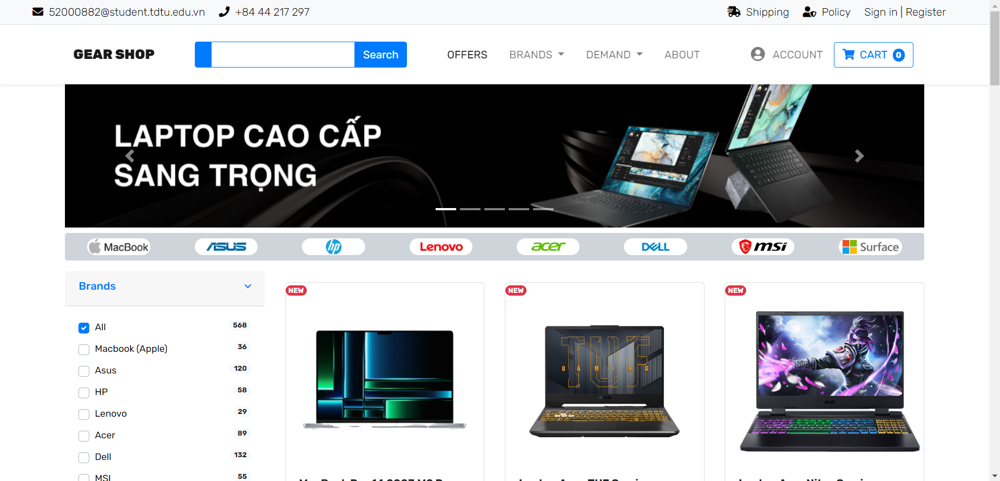<br><br>

<br><br>

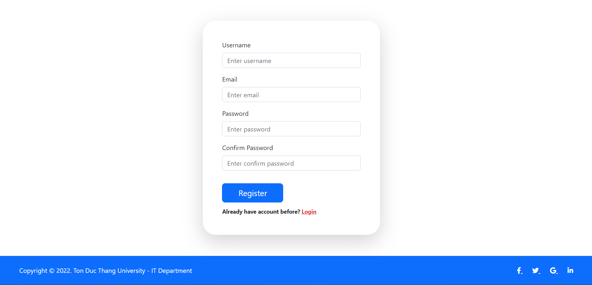<br><br>

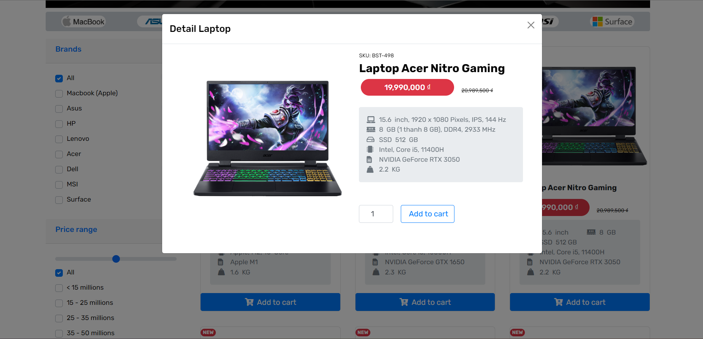<br><br>

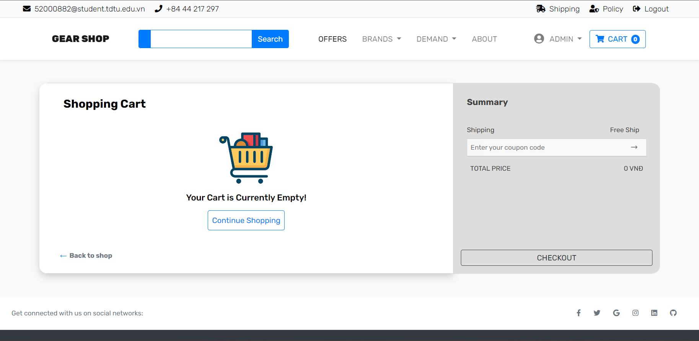<br><br>

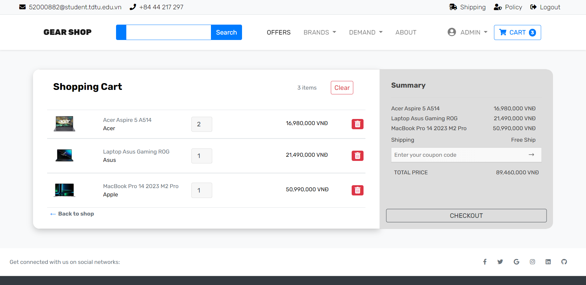<br><br>

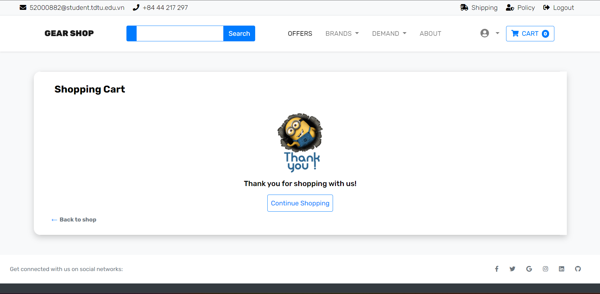<br><br>

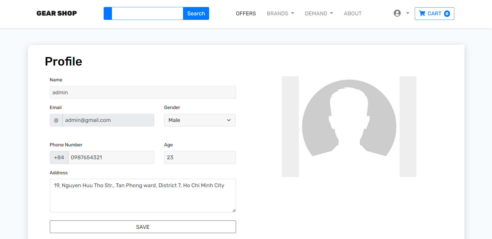<br><br>

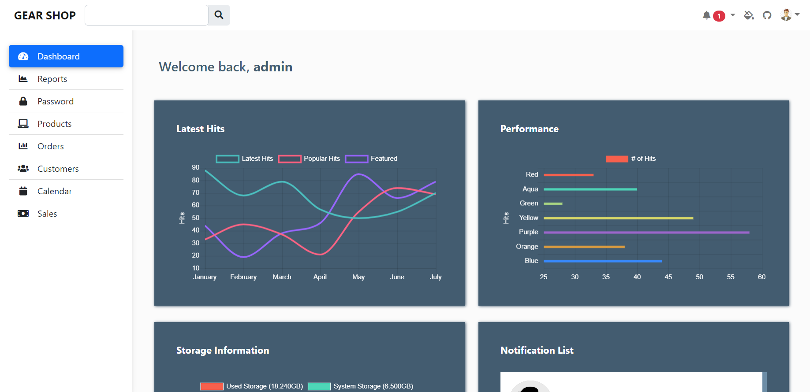<br><br>

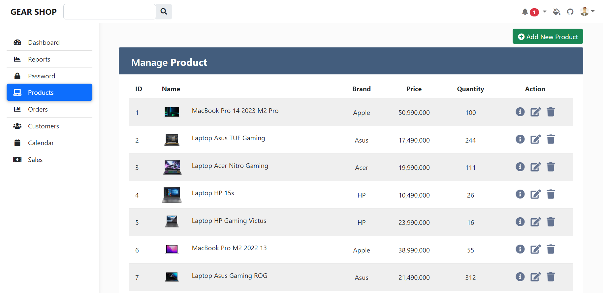<br><br>

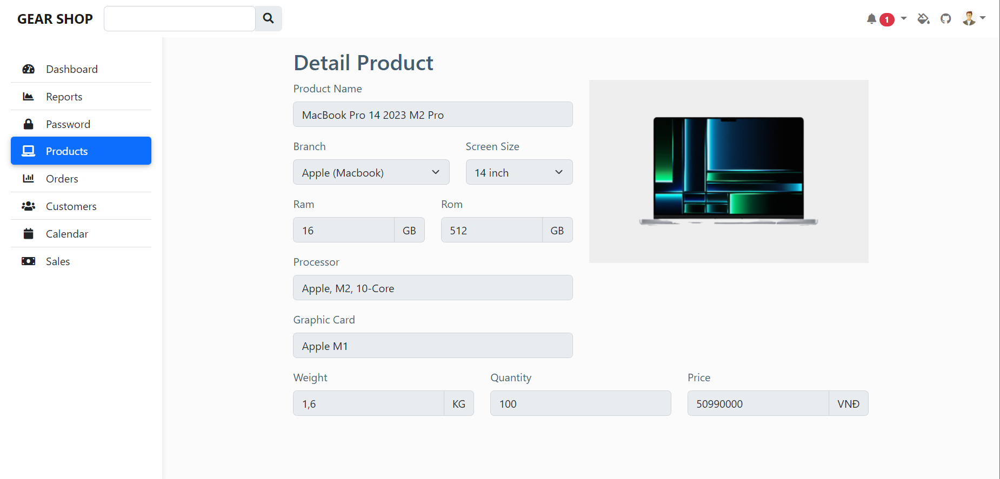<br><br>

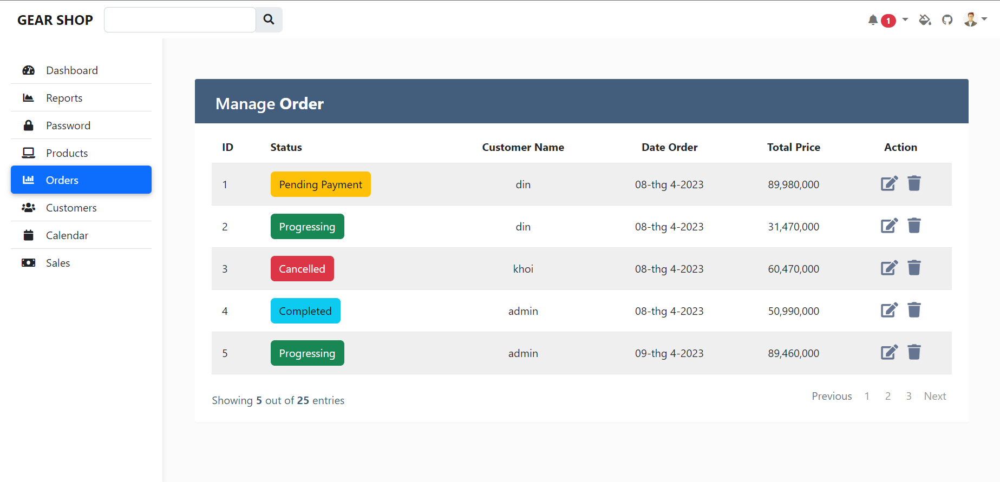<br><br>

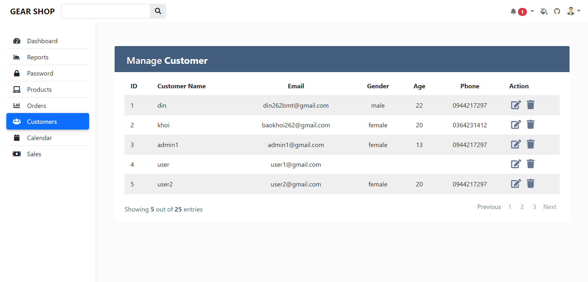<br><br>

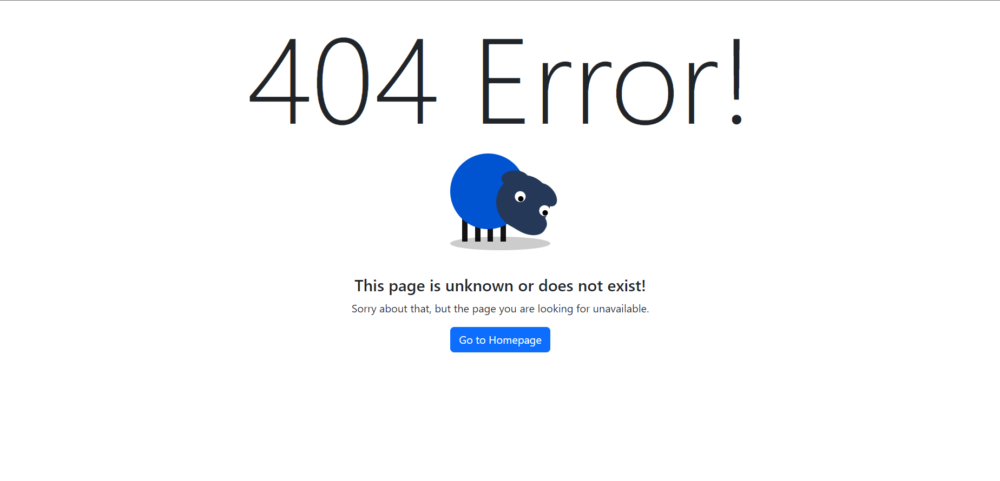<br><br>

## References

1. (65%) github - anshu20126/spring-boot-user-registration-and-Login
    * Link: https://github.com/anshu20126/spring-boot-user-registration-and-Login
2. (75%) javaguides.net - Spring Boot User Registration and Login Example Tutorial
    *
    Link: https://www.javaguides.net/2018/10/user-registration-module-using-springboot-springmvc-springsecurity-hibernate5-thymeleaf-mysql.html
3. (80%) codejava.net - Spring Boot File Upload Tutorial (Upload and Display Images)
    * Link: https://www.codejava.net/frameworks/spring-boot/spring-boot-file-upload-tutorial
4. (84%) codejava.net - Spring Data JPA Filter Search Examples
    * Link: https://www.codejava.net/frameworks/spring-boot/spring-data-jpa-filter-search-examples
5. (82%) youtube - Spring Boot serie
    * Link: https://youtube.com/playlist?list=PLwG1of-HdCq-cLcoh_70SITb-Sq3vC_vG
6. (66%) youtube - Building eCommerce Store Using Spring MVC and Spring Data JPA in Spring Boot - Part 8 - Checkout
    * Link: https://youtu.be/-L0P0yrvVhk
